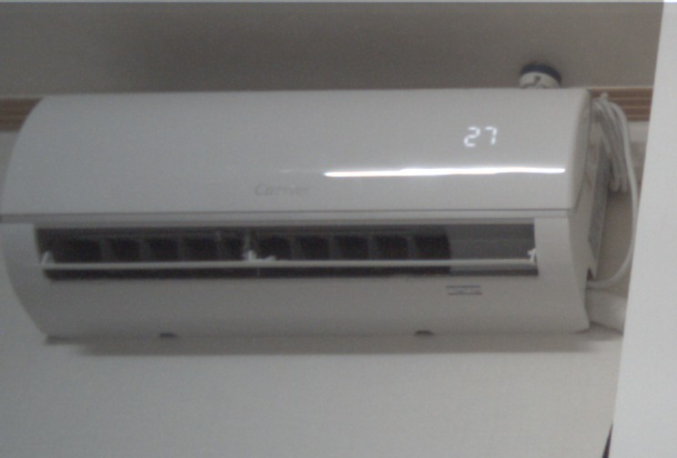

# MT8183 Kukui — postmarketOS 활성화 기록

Lenovo IdeaPad Duet Chromebook (`google-krane`) 에서 메인라인 리눅스가
지원하지 않거나 Plasma Mobile에서 바로 쓰기 어려웠던 기능을 동작시킨 기록.

- **USB-C 외부 디스플레이 + DP 오디오** (ITE IT6505 브리지)
- **전·후면 카메라** (OV8856 / OV02A10 → seninf → ISP Pass 1 → libcamera)
- **키보드 커버 입력 모드 자동 전환** (Plasma Keyboard ↔ IBus Hangul)

대상: postmarketOS v26.06, 커널 6.18.28
(`linux-postmarketos-mediatek-mt81`), Plasma Mobile 6.6.6

`device-google-kukui` 패키지가 커버하는 16개 보드(krane, kodama, kakadu,
katsu, juniper, fennel, willow 등)가 같은 DT 를 쓰므로, 대부분 그대로
적용되거나 소폭 수정으로 동작할 가능성이 높다. **krane 에서만 실측했다.**

## 결과

| | 상태 |
|---|---|
| 외부 디스플레이 | `card1-DP-1` connected, EDID 판독, 1920x1080 |
| DP 오디오 | `hw:0,7` 재생 확인 |
| 전면 카메라 | OV02A10 1600x1200 |
| 후면 카메라 | OV8856 3280x2464 |
| libcamera | 두 카메라 모두 열거. 전면 1596x1200 30 fps, 후면 **3276x2464 37 fps** ABGR8888 |
| 키보드 커버 부착 | 독 모드 + IBus Hangul 자동 전환 |
| 키보드 커버 분리 | 모바일 모드 + Plasma Keyboard OSK 자동 전환 |

전면 카메라(OV02A10) 촬영 샘플 — 소프트웨어 ISP 만으로 디베이어·화이트밸런스한 결과:



## 왜 필요했나

메인라인 커널에는:

- IT6505 **드라이버는 있지만**(`CONFIG_DRM_ITE_IT6505`) kukui DT 에
  `dpi0` 와 브리지 노드가 없다
- MediaTek 카메라 스택(seninf / ISP P1) 은 **아예 없다**.
  2020년 RFC v7 에서 업스트림이 멈췄다

ChromeOS 커널은 둘 다 갖고 있고, **카메라 스택은 6.6 까지 포워드포트**돼
있다. 그래서 5.10 이 아니라 6.6 을 출발점으로 삼았다.

## 설치

pmOS 순정 설치본에 apk 세 개를 얹으면 된다. 기기에서 빌드할 것은 없다.
자세한 내용은 [INSTALL.md](INSTALL.md).

```sh
sudo apk add --allow-untrusted linux-postmarketos-mediatek-mt81-*.apk \
    device-google-kukui-*.apk libcamera-*.apk
sudo mkinitfs && sudo reboot
```

## 구성

```
display/patches/      DPI + IT6505 브리지 + DP 오디오 DT 패치
camera/dt/            seninf · camisp 노드, 센서 노드
camera/driver/        6.18 로 포팅한 드라이버 소스
camera/patches/       ChromeOS 6.6 원본 대비 변경분
libcamera/            소프트웨어 ISP 활성화 (pmaports APKBUILD)
plasma-mobile/        Plasma Mobile 사용자 공간 통합 패키지
tools/                캡처 · 브리지 · RAW 후처리
docs/findings.md      문서에 없던 발견들
docs/process.md       막힌 지점과 판별 방법
```

## 빠른 요약

**디스플레이** — 커널 재빌드 불필요. DTB 세 군데만 고치면 된다.

**카메라** — 드라이버 포팅 실제 수정량은 seninf 4줄, cam 5군데.
시간을 먹은 건 포팅이 아니라 CFI 툴체인 불일치, 클럭 mux 재부모화,
핀mux 누락, MTISP 포맷 오해였다.

**Snapshot(libcamera)** — 미디어 디바이스 이름, pad ops, `V4L2_CAP_IO_MC`,
표준 베이어 fourcc 노출, CMA 크기, 비요청 스트리밍 — 여섯 겹.

**Plasma Mobile 입력** — KWin의 태블릿 모드 D-Bus 신호를 기준으로 커버
키보드 부착 상태를 판별한다. 일반 USB·Bluetooth 키보드와 Logi Unifying
수신기는 자동 전환을 일으키지 않는다. 빌드와 설치 방법은
[`plasma-mobile/input-mode/`](plasma-mobile/input-mode/)에 정리했다.

## 빌드

```bash
# 커널 모듈 (Clang 필수 — pmOS 커널이 kCFI 빌드)
make -C <kernel-tree> M=$PWD/camera/driver/seninf LLVM=1 ARCH=arm64 modules

# DTB
patch -p1 -d <kernel-tree> < display/patches/0001-dt-enable-dpi-it6505.patch
make -C <kernel-tree> LLVM=1 ARCH=arm64 mediatek/mt8183-kukui-krane-sku176.dtb
```

기기에서 `mkinitfs` 로 kpart 를 다시 만들면 반영된다.

Plasma Mobile 입력 모드 패키지는 커널 빌드와 독립적이다.

```bash
cd plasma-mobile/input-mode
abuild checksum
abuild -r
```

## 알려진 제약

- 카메라 튜닝 파일(`ov8856.yaml` / `ov02a10.yaml`)이 없어 `uncalibrated.yaml`
  로 동작한다. 색 정확도가 떨어진다.
- ISP 의 `dip`(후처리) 단은 포팅하지 않았다. 디베이어·노이즈 저감은
  libcamera 의 소프트웨어 ISP 가 담당한다.
- 후면 카메라는 AF(dw9768) 를 연결하지 않아 고정 초점이다.
- libcamera 의 카메라 인덱스는 재부팅마다 바뀐다. `cam -c1` 대신
  `cam --list` 가 주는 고정 ID 를 써야 한다.
- 벤더 fourcc 때문에 카메라 열거 시 `Unknown pixelformat` 커널 WARN 이
  쌓인다. 동작에는 영향이 없다.
- 모듈 자동 로드까지 확인했다. apk 설치 후 재부팅하면 `insmod` 없이 잡힌다.
- 입력 모드 자동 전환은 KWin이 하드웨어 태블릿 모드 스위치를 제공하는
  기기에서만 활성화된다. 그 외 기기에서는 빠른 설정 타일을 수동으로 쓴다.

## 라이선스

커널 소스는 원본과 동일하게 GPL-2.0.
`camera/driver/` 는 ChromeOS 커널(`drivers/media/platform/mediatek/isp/isp_50`)
에서 가져와 6.18 로 포팅한 것이다. 저작권은 원 저작자(MediaTek)에게 있다.

DT 파일은 `GPL-2.0 OR MIT`, Copyright (c) 2018 MediaTek Inc.

`plasma-mobile/input-mode/`는 해당 디렉터리의 `LICENSE`에 따라 MIT로
배포한다.

## 업스트림에 대해

이 저장소의 내용은 AI 어시스턴트(Claude, OpenAI Codex)와의 작업으로
만들어졌다.

- **postmarketOS 는 AI 기여물 제출을 금지한다**
  ([AI Policy](https://docs.postmarketos.org/policies-and-processes/development/ai-policy.html)).
  pmaports 에 그대로 제출해서는 안 된다.
- **리눅스 커널은 조건부로 허용한다.** `Documentation/process/generated-content.rst`
  와 `coding-assistants.rst` 를 따라 `Assisted-by: LLM` 태그와 도구·검증
  내용을 밝히고, 사람이 `Signed-off-by` 로 책임져야 한다.
